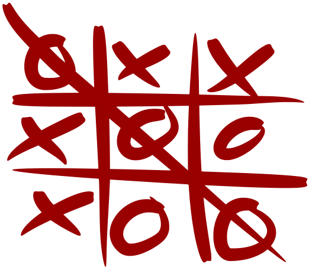

## Overview

The classic game Tic-Tac-Toe is a ***solved problem*** and it rapidly becomes uninteresting as players figure out that there are very few opportunities to make ***meaningful decisions*** in the course of a game. In this assignment you are going to work with your table partner to experiment with changes to the ***mechanics*** of Tic-Tac-Toe in hopes of transforming it into a challenging and engaging game.

In this assignment you will be practicing the ***iterative*** process that is at the core of most design work to test out your ideas for improvements to Tic-Tac-Toe.

## Goals
* Understand that small changes to game mechanics can have a large impact on the system of a game.
* Practice using the iterative process.
* Get to know some of your coleagues.

## The Process

### Define the Problem

As we discuss the good and bad points of Tic-Tac-Toe, make some notes. The bad points could be the seeds of ideas about how to fix the game, and the good points will help you to keep the character of the game intact.

You may also find it useful to write out the rules of the game - they can help you think about what you could change.

### Brainstorm New Or Modified Mechanics

### Playtest

### Iterate

<!--

## Understand the Mechanics

1. Develop a common understanding of the rules of Tic-Tac-Toe - I'll write them on the board, but you should also be reconding them in your notes.
1. Why is Tic-Tac-Toe a "solved problem?"
1. What changes could we make to make the game more engaging and challenging - to increase the "meaningfulness" of the player's decisions?

Then discuss why Tic-Tac-Toe always ends in a draw for most players. Have the class brainstorm what they might modify in order to change the game: the grid size and shape, the number of players, the winning conditions, the things you can do on a turn, etc.

## Modify!
Pairs of students try to redesign the game in order to increase the space of possibility of the game – to make it more interesting to play than the “solved problem” of classic Tic-Tac-Toe.

As they design, have them change as little as possible – one, two, or three rules at the most. They should follow the iterative process of making small changes, playing their modified version, analyzing how they affected the game, and then redesigning again.

Finally, groups can share their modifications with the class, and what did and didn’t work. If there are too many groups for everyone to share, then pairs of groups can play each others’ games and discuss. -->
