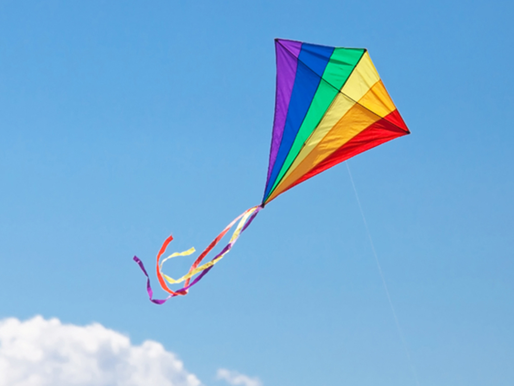
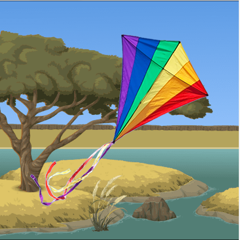

---
---

[//]: # ( <p><iframe src="https://douglasurner.github.io/GDP1/units/2/assignments/U2.5-other-inputs/" width="100%" height="666px"></iframe></p> )



## Just Enough Photoshop

[slides]: https://docs.google.com/presentation/d/1gM5BeHbx0E7Y9HE74nNp8vlQTB_Io1i9UpIdZ06HVpw/edit?usp=sharing
[template]: https://docs.google.com/document/d/1nuKdGzzO0zpyPj3YNVnIUP1G_JCczc7q5YDwRepFJK8/edit?usp=sharing

To use an images as sprites, you often need to remove the background and in many cases you will need to reduce the size of the image to get around the 100 KB limit imposed by Game Lab. In this assignment we will practice this skill, then you will independently remove the background and resize an image for your use.


Look closely at the example of the kite in Game Lab. Can you see the faint edge of blue along the left hand side where it overlaps the tree?



Many images on the web are in JPEG format. JPEG does not support transparency, so we will need to save the images in the Portable Network Graphic (PNG) format.

Your edited image will look similar to the one on the right and will composite seemlessly with other sprites and backgrounds in Game Lab. You can use the ```sprite.scale``` property to adjust the size of the image when the sprite is displayed.

[Slides: Just Enough Photoshop][slides] - right-click and choose **Open link in a new tab** to view.

### Learning Targets:

I can:
* Use Photoshop to remove the background in an image.
* Use Photoshop to crop an image.
* Use Photoshop to reduce the size of an image.
* Save in image in PNG format (to preserve transparancy).

## Instructions

Follow along as we walk through the process together. Then:

1. Find an image that you would like to use in Game Lab.
1. Download the image.
1. Open it in Photoshop.
   - Unlock the Background layer (it will be renamed Layer 0).
   - Use the Magic Wand tool to select the background.
   - Delete the background.
   - Crop the image.
   - Resize the image.
1. Save the image as a PNG.
1. Upload it as a new sprite in Game Lab.
   - Use the image as the animation for a sprite.
   - Put the sprite on a contrasting background.
   - Check to see if it looks "seamless" with no tell-tale "stuff" around the edges. If you notice that there is some remaining background, go back to Photoshop and clean it up.
1. Make a copy of the [submission template][template] and fill it out.
1. Once you've completed the template, submit it.

Photoshop has a **lot** of buttons and there a plenty of ways to get Photoshop confused (and when it is confused it takes it out on you...). It may help to follow along with the [slides][]. Fortunately, this task is usually pretty quick, so don't be afraid to start over. Another good thing to know is that in Photoshop Control-Z undoes the **last** thing you did. To step backwards through your history, use Control-Alt-Z.

## Submission

After completing your [template][], submit a PDF through Canvas - **do not** submit by sharing the document.


