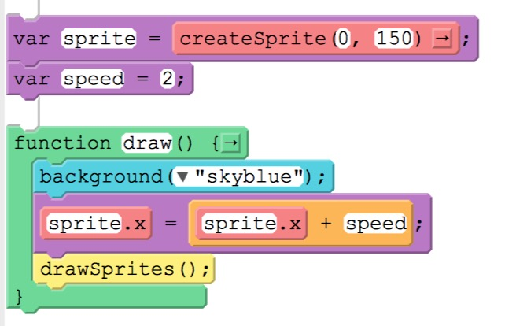

## Lesson 8: The Counter Pattern

Patterns are insights into writing code that give us solutions to commonly occurring problems that we need to solve as we create programs. One of the most common problems is implementing an incremental change over time - for example a sprite moving across the screen - the **counter pattern** gives us a very simple solution to this problem.

### The Counter Pattern



### Learning Targets:

* I can describe the connection between updating a sprite's location properties and the sprite's movement on the screen.
* I can read and follow the steps of a short program written in pseudocode that manipulates variable values.
* I can describe and use the **counter pattern** in a program that moves a sprite in my scene.

### Project

For this project we will use the **Project** facility on the Code.Org web site to create an animated scene using the full GameLab IDE. Before you start coding, work out your scene idea(s) in your notes (be sure they are dated) - remember to include an element that uses the counter pattern. When you are ready to start coodoing, you cano get to the Projects section by:

1. Go to **My Dashboard** to get there:
   - Click on the black Code.Org logo in the upper left hand corner.
   - Click on the pancake (there horizontal lines) logo in the uppper right hand corner, then select My Dashboard from the dropdown menu.
2. In the menu bar at the top of the window, click on the **Projects** tab.
3. From the projects page, select the **GameLab** IDE.

Your goal is to code a scene in which you show off the skills that you have been developing:

* Creating simple shapes and backgrounds.
* Using the ```randomNumber()``` function.
* Organizing your code with variables.
* Creating sprites and adding an animation (image) to them.
* Using the **draw loop** to animate a scene.

Combine those skills with the **counter pattern** to animate a scene of your design.

## Submissions

Finalize your project for submission by clicking on the **Share** button, then copy the resulting URL to include in your submission.

Please make sure that your name is on the **Variables Unplugged** acticvity guide and turn it in.

Submit a PDF document in which you:

* Explain the **Counter Pattern** in your own words, using examples from your project.
* Include a link to your project on Game Lab.
