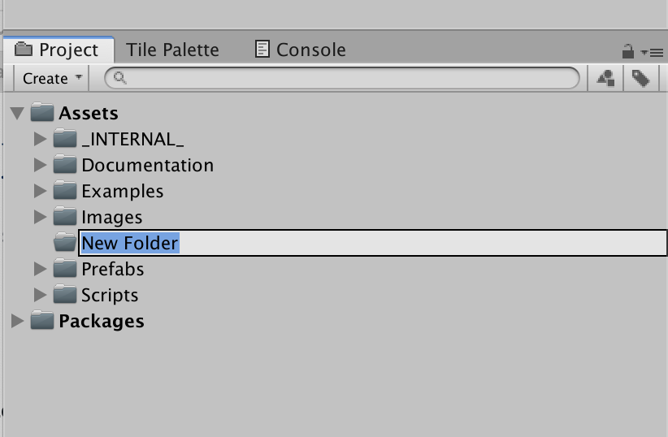

# Building Your First Unity Game

Note:

---

@snap[west span-60]

### Switch To One-Column Layout

1. Click on the "pancake menu" in the upper right-hand corner of the Project pane.
1. Select the **One Column Layout** item.

@snapend

@snap[east span-40]

@snapend

Note:

The one-column layout makes it easier to see the contents of the assets folder.

---

### Create A Folder For Your Game

