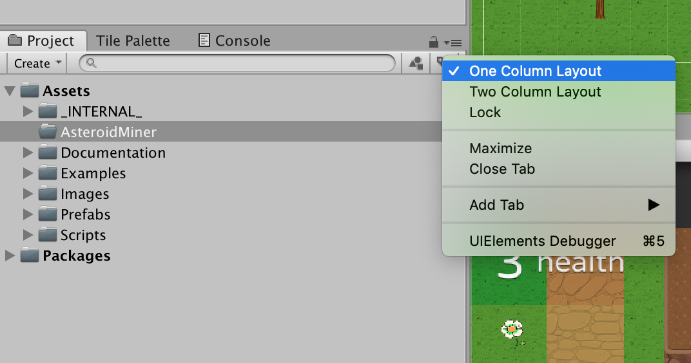

# Assignment Name

Note:

---

### Switch To One-Column Layout

1. Click on the "pancake menu" in the upper right-hand corner of the Project pane.
1. Select the **One Column Layout** item.

---

### Create A Folder For Your Game

