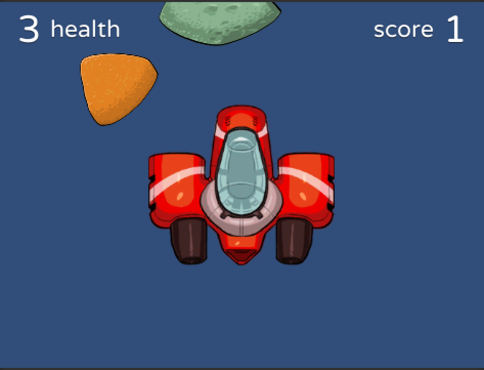

---
---

[//]: # ( <p><iframe src="https://douglasurner.github.io/COURSE_SHORT_NAME/units/UNIT_#/assignments/#-ASSIGNMENT_SHORT_NAME/" width="100%" height="666px"></iframe></p> )

## Building Your First Unity Game

[slides]: <https://gitpitch.com/DouglasUrner/GDP1?p=units/4/assignments/2-first-unity-game>
[template]: <https://docs.google.com/document/d/1Xoz-bjT4HfPt41hUefazcZuPo5vb6eDJupQLSq4mAP8/edit?usp=sharing>



A great way to practice - and extend - what you learned in the introductory tutorials is to build a small game. 
We'll start off using the UnityPlayground, a set of assets for creating 2D gams to build a small game. In the game an asteroid mining ship collects "nuggets" while dodging asteroids.

The the main instructions for building the game are in the **Getting Started - Unity Playground** document in the UnityPlayground Documentation folder. But before you dive in, follow the instructions in the [slides][] to get your game set up.

[Slides: Building Your First Unity Game][slides] - right-click and choose **Open link in a new tab** to view.

### Learning Targets:

* I can create folders in Unity.
* I can create new scenes in Unity.
* I can rename GameObjects and other Unity assets.
* I can create **prefabs** in Unity.
* I can adjust GameObject parameters in the Inspector.

## Instructions

1. Launch Unity Hub and open your UnityPlayground project.
   - The UnityPlayground project folder should be on your desktop. If you don't have a copy of the project (or if you'd like to start over with a fresh copy), locate the folder on the P: drive (navigate to the Collaboration folder for our class in ```P:\Instruction\Douglas_Urner```) and drag the UnityPlayground folder to your desktop.
1. Follow the instructions in the [slides][] to:
   - Create a folder to hold your game's assets.
   - Create a new scene file to build the game in.
1. After you've set up your project, follow along in the **Getting Started** tutorial (in the Documents folder) to build your first game.
1. As you're working, pay attention to the conventions used in the project and match them. Consistent code is a virtue.
1. Make a copy of the [submission template][template] and fill it out.
1. Once you've completed the template, submit it.

## Submission

After completing your [template][], submit a PDF through Canvas - **do not** submit by sharing the document.
